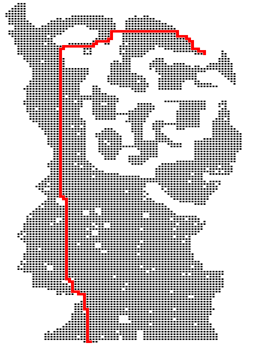
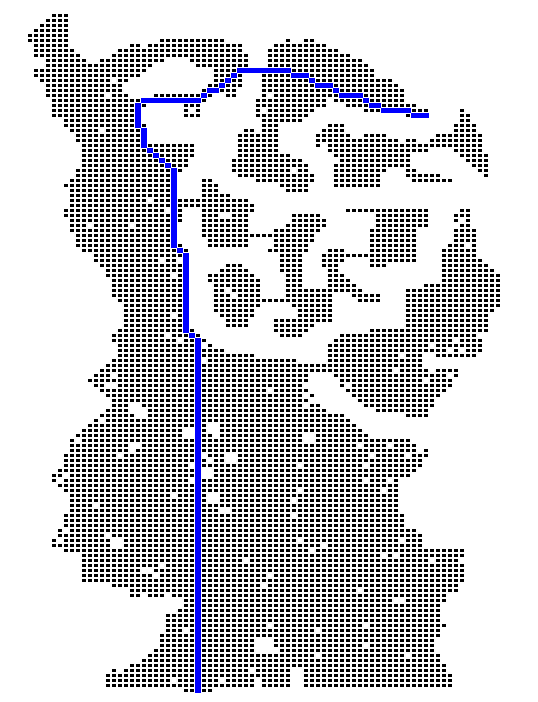

## Rank pairing heaps

### Introduction
This is a **header-only** implementation of rank-pairing heaps written in **C++14**. Derived from the lazy [binomial queue](https://en.wikipedia.org/wiki/Binomial_heap), the rank-pairing heaps utilizes rank restriction to maintain a balance among its half trees. Heaps are widely applied in algorithms such as heapsort, k-smallest elements, Prim's, and the renowned Dijkstra's shortest-path algorithm. This implementation was born out of the need for:

* [std::priority_queue](http://www.cplusplus.com/reference/queue/priority_queue/) does not support decrease-key
* [Fibonacci heap](https://en.wikipedia.org/wiki/Fibonacci_heap) is theoretically fast but not good in practice
* A practical alternative to the [d-ary heap](https://en.wikipedia.org/wiki/D-ary_heap) and [pairing heap](https://en.wikipedia.org/wiki/Pairing_heap)

In game development, [A* algorithm](https://en.wikipedia.org/wiki/A*_search_algorithm) is a standard shortest path algorithm. The `example/main.cpp` file provides a demo of A* pathfinding using `rp-heap`.

### Usage
The implementation mimics STL containers and provides **STL-like** member functions. 
To use it, simply include the header file
```cpp
#include "rp_heap.h"
```

##### Basic member functions
```C++
// make heap
rp_heap<T> heap;

// capacity
bool empty() const;
size_t size() const;

// find-min
const T& top() const;

// insert, returns an iterator holding the internal pointer of node for the parameter of decrease key
const_iterator push(const T& val);
const_iterator push(T&& val);

// delete-min
void pop();
void pop(T& val);

// delete-all
void clear();

// decrease-key, use the iterator returned by push
void decrease(const_iterator it, const T& val);

// for type 1 rank reduction (default type 2)
#define TYPE1_RANK_REDUCTION
```

##### Pool allocator for cache-friendly allocation
By default, `rp_heap` allocates each node individually on the heap. For workloads where allocation throughput matters, use the included `pool_allocator` which allocates nodes from contiguous memory blocks:

```cpp
#include "rp_heap.h"
#include "pool_allocator.h"

// Use pool allocator — all operations are identical
rp_heap<int, std::less<int>, pool_allocator<int>> heap;

heap.push(42);
auto it = heap.push(10);
heap.decrease(it, 5);
heap.pop();
```

The pool allocator takes an optional block size template parameter (default 4096 bytes):
```cpp
// Larger blocks for big heaps — fewer internal allocations
rp_heap<int, std::less<int>, pool_allocator<int, 65536>> heap;
```

##### Test program

```C++
#include <iostream>
#include <algorithm> // std::shuffle
#include <random>
#include "rp_heap.h"
#include <vector>

int main()
{
    std::vector<int> v;
    int size = 1000;
    for (int i = 0; i < size; i++)
        v.push_back(i + 1); // v = {1, 2,... 1000}
    std::shuffle(v.begin(), v.end(), std::mt19937{std::random_device{}()}); // shuffle v
    
    rp_heap<int> heap;
    std::vector<rp_heap<int>::const_iterator> its; // save the iterators returned from push
    for (int i = 0; i < size; i++)
        its.push_back(heap.push(v[i]));
        
    heap.decrease(its[0], 0); // a number decreases to 0
    heap.pop(); // pop that number
    
    for (int i = 1; i < size; i++)
        heap.decrease(its[i], *its[i] - 1); // each element in heap is decreasd by 1
    while (!heap.empty())
    {
        int x;
        heap.pop(x);
        std::cout << x << '\n'; // will print the number from {1, 2,...999} but missing the one in the first pop
    }
    return 0;
}
```

### Building and Testing
Requires CMake 3.14+ and a C++14 compiler. [Google Test](https://github.com/google/googletest) is fetched automatically.

```bash
cmake -B build -S .
cmake --build build
cd build && ctest --output-on-failure
```

#### Benchmarks
[Google Benchmark](https://github.com/google/benchmark) is fetched automatically.

```bash
cmake -B build -S .
cmake --build build --target bench_rp_heap --config Release
./build/bench_rp_heap            # Linux/macOS
.\build\Release\bench_rp_heap    # Windows
```

The benchmark suite (`bench/bench_rp_heap.cpp`) compares `rp_heap` against `std::priority_queue` across push, pop-all, interleaved push/pop, and decrease-key workloads with 1K to 1M elements.

##### Sample results (i7-13700KF, GCC 8.1, Windows, Release build)

| Benchmark | 1K | 10K | 100K | 1M |
|---|---|---|---|---|
| **rp_heap push** | 37 us | 325 us | 3.2 ms | 49 ms |
| **rp_heap pop-all** | 163 us | 2.2 ms | 29 ms | 622 ms |
| **rp_heap push+pop** | 155 us | 2.0 ms | 27 ms | 591 ms |
| **rp_heap decrease-key** | 39 us | 331 us | 3.4 ms | 49 ms |
| **rp_heap+pool push** | 6.6 us | 75 us | 756 us | 14 ms |
| **rp_heap+pool pop-all** | 119 us | 1.8 ms | 25 ms | 522 ms |
| **rp_heap+pool push+pop** | 82 us | 1.3 ms | 18 ms | 462 ms |
| **rp_heap+pool decrease-key** | 8.3 us | 95 us | 985 us | 18 ms |
| std::priority_queue push | 2.0 us | 76 us | 845 us | 9.4 ms |
| std::priority_queue pop-all | 22 us | 493 us | 6.2 ms | 77 ms |

`std::priority_queue` is faster for raw push/pop throughput thanks to its cache-friendly contiguous array. The `pool_allocator` closes much of that gap: **push is 3-5x faster** than the default allocator and **decrease-key improves 3-5x** as well, thanks to contiguous node memory reducing cache misses. The advantage of `rp_heap` is **O(1) decrease-key** — an operation `std::priority_queue` does not support at all — which is essential for Dijkstra's, A*, and Prim's algorithms.

The test suite (`test/test_rp_heap.cpp`) covers:
- Push, top, pop, size, empty, clear
- Extract-min ordering (random values pop in sorted order)
- `pop(T& val)` output parameter variant
- `pop()` on empty heap throws `std::runtime_error`
- Decrease-key (root, non-root, becoming new min)
- Large random stress test (10,000 elements)
- Custom comparator (max-heap via `std::greater`)
- Move semantics
- Memory leak detection via counting allocator

### Performance
| Operations    | Amortized time|
| ------------- |:-------------:|
|find-min|*O*(1)|
|delete-min|*O*(*log* n)|
|insert|*O*(1)|
|decrease-key|*O*(1)|
|size|*O*(1)|
|delete-all|*O*(n)|
* For detailed analysis of rp-heap, see [1]


### A* algorithm using rp-heap
A sample map taking from MMORPG [Strugarden NEO](https://ja.wikipedia.org/wiki/%E3%82%B9%E3%83%88%E3%83%A9%E3%82%AC%E3%83%BC%E3%83%87%E3%83%B3)


Transformed 2D grid Map


Shortest path by BFS (unweighted, 4-direction movement)





Shortest path by A* (weighted, 8-direction movement)





### References
[1] B. Haeupler, S. Sen, and R. E. Tarjan. Rank-pairing heaps. SIAM J. Comput., 40:1463–1485, 2011.


[2] Cherkassky, Boris V.; Goldberg, Andrew V.; Radzik, Tomasz (1996), "Shortest paths algorithms: theory and experimental evaluation", Mathematical Programming, Series A 73 (2): 129–174, doi:10.1016/0025-5610(95)00021-6, MR 1392160


[3] [Introduction to A*](http://theory.stanford.edu/~amitp/GameProgramming/AStarComparison.html)
